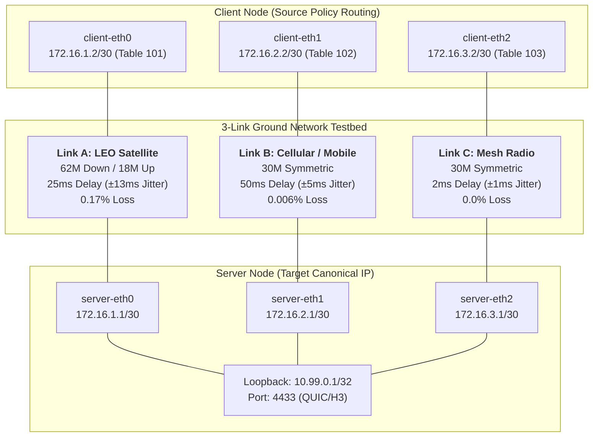

# Multipath QUIC (`n0q`) Experimental Report & Documentation
**3-Link Ground Testbed Evaluation: Stream vs. Datagram Modes**

---

## 1. Executive Summary

This document presents the complete experimental evaluation of **Multipath QUIC (`n0q`)** conducted on an emulated 3-link heterogeneous network topology. The testbed models three distinct ground communication channels: **LEO Satellite (Link A)**, **Cellular / Mobile (Link B)**, and **Mesh Radio (Link C)**.

Two comprehensive 12-combination test sweeps were performed across **3 Packet Schedulers** (`MINRTT`, `REDUNDANT`, `ROUNDROBIN`) and **4 Congestion Control algorithms** (`BBR`, `BBR3`, `CUBIC`, `COPA`):

1. **Stream Mode Benchmark (Bulk Reliable Transfer)**: Evaluated high-throughput data delivery (~80–109 MB transferred per 15 s run, achieving 21.5–32.9 Mbps).
2. **Datagram Mode Benchmark (Unreliable Real-Time Transfer)**: Evaluated 1200-byte datagram echoing across multipath subflows (175–985 datagrams sent per run).
3. **Connection ID (CID) Lifecycle & Stability Analysis**: Verified the robustness of `n0q` against connection drops and CID exhaustion previously observed in `picoquic`.

---

## 2. Testbed Architecture & Network Topology



### Link Characteristics & Traffic Shaping Parameters

| Interface Link | Link Name | Emulated Tech | Bandwidth (Srv / Cli) | Delay | Jitter | Loss Rate | Routing Table |
| :--- | :--- | :--- | :--- | :--- | :--- | :--- | :--- |
| **Link A** (`eth0`) | LEO Satellite | Starlink / OneWeb | **62 Mbps / 18 Mbps** | 25 ms | ±13 ms | 0.17 % | Table `101` |
| **Link B** (`eth1`) | Mobile / Cellular | 4G LTE / 5G | **30 Mbps / 30 Mbps** | 50 ms | ±5 ms | 0.006 % | Table `102` |
| **Link C** (`eth2`) | Mesh Radio | Tactical Mesh / Wi-Fi | **30 Mbps / 30 Mbps** | **2 ms** | ±1 ms | **0.0 %** | Table `103` |

- **Server Canonical IP**: `10.99.0.1/32` configured on the server loopback (`lo`).
- **Multipath Binding**: The client initiates the primary connection via `172.16.1.2` (Link A) and subsequently establishes active subflows on `172.16.2.2` (Link B) and `172.16.3.2` (Link C) using `open_path_ensure()`.

---

## 3. Experiment 1: Stream Mode Evaluation (Bulk Transfer)

In Stream mode, the client initiates a continuous bidirectional stream request (`GET /video`), and the server delivers continuous 64 KB application data chunks over the 15-second benchmark window.

### Stream Mode Sweep Matrix

| Combination | Total RX (Bytes) | Total RX (MB) | App Throughput | Link A Share (%) | Link B Share (%) | Link C Share (%) | Exit Code |
| :--- | :---: | :---: | :---: | :---: | :---: | :---: | :---: |
| **`MINRTT + BBR`** | 80,541,044 | 76.8 MB | **27.70 Mbps** | 7.2 % | 37.9 % | **55.0 %** | `0` |
| **`MINRTT + BBR3`** | 103,153,724 | 98.4 MB | **30.31 Mbps** | 6.4 % | 48.6 % | **45.0 %** | `0` |
| **`MINRTT + CUBIC`**| 97,090,909 | 92.6 MB | **27.69 Mbps** | 12.6 % | **50.4 %** | 37.0 % | `0` |
| **`MINRTT + COPA`** | 95,003,278 | 90.6 MB | **28.64 Mbps** | 7.4 % | 43.9 % | **48.7 %** | `0` |
| **`REDUNDANT + BBR`**| 108,365,306 | 103.3 MB | **30.52 Mbps** | 13.2 % | 44.7 % | 42.0 % | `0` |
| **`REDUNDANT + BBR3`**| 82,488,268 | 78.7 MB | **27.70 Mbps** | 8.6 % | 34.5 % | **56.9 %** | `0` |
| **`REDUNDANT + CUBIC`**| 75,378,202 | 71.9 MB | **21.47 Mbps** | 7.9 % | 25.3 % | **66.8 %** | `0` |
| **`REDUNDANT + COPA`**| 109,320,656 | 104.3 MB | **32.87 Mbps** | 11.2 % | 45.1 % | 43.7 % | `0` |
| **`ROUNDROBIN + BBR`**| 89,639,112 | 85.5 MB | **28.08 Mbps** | 7.4 % | 47.1 % | 45.5 % | `0` |
| **`ROUNDROBIN + BBR3`**| 88,415,184 | 84.3 MB | **28.45 Mbps** | 7.3 % | 41.4 % | **51.3 %** | `0` |
| **`ROUNDROBIN + CUBIC`**| 88,846,999 | 84.7 MB | **24.22 Mbps** | 8.1 % | 33.8 % | **58.2 %** | `0` |
| **`ROUNDROBIN + COPA`**| 94,539,209 | 90.2 MB | **27.18 Mbps** | 6.4 % | **53.3 %** | 40.3 % | `0` |

### Key Stream Findings
1. **Link C (Mesh Radio, 2 ms delay) Domination**: Because stream transmission relies on cumulative acknowledgments, the minimal RTT on Link C allowed rapid congestion window growth and quick ACK feedback. Link C carried between **37.0% and 66.8%** of all data.
2. **Link B (Cellular, 50 ms delay) High Utilization**: Despite its higher latency, Link B's zero-loss stability allowed it to absorb **33.8% to 53.3%** of data once Link C reached capacity.
3. **Link A (LEO Satellite) Throttle**: Link A's 0.17% packet loss and 13 ms jitter caused loss-based CC algorithms (CUBIC) and delay-sensitive pacers to favor the zero-loss links, limiting Link A to **6.4%–13.2%** share.
4. **Top Performer**: `REDUNDANT + COPA` (104.3 MB, 32.87 Mbps) and `MINRTT + BBR3` (98.4 MB, 30.31 Mbps) yielded the highest aggregate data volume.

---

## 4. Experiment 2: Datagram Mode Evaluation (Real-Time Transfer)

In Datagram mode, the client sends 1200-byte unacknowledged datagrams via `conn.send_datagram()` at 200 µs intervals, and the server echoes received datagrams back to the client.

### Datagram Mode Sweep Matrix

| Combination | Dgrams Sent | Dgrams Recv | Echo Loss Rate | App Throughput | Link A Share (%) | Link B Share (%) | Link C Share (%) | Total RX (Bytes) |
| :--- | :---: | :---: | :---: | :---: | :---: | :---: | :---: | :---: |
| **`MINRTT + BBR`** | 260 | 43 | 83.5 % | 0.03 Mbps | 42.6 % | 22.9 % | 34.5 % | 86,361 B |
| **`MINRTT + BBR3`** | 480 | 156 | **67.5 %** | 0.10 Mbps | 53.0 % | 8.3 % | 38.7 % | 236,957 B |
| **`MINRTT + CUBIC`** | **985** | **260** | 73.6 % | **0.17 Mbps** | 38.1 % | 11.8 % | **50.1 %** | **373,722 B** |
| **`MINRTT + COPA`** | 175 | 18 | 89.7 % | 0.01 Mbps | 65.3 % | 13.6 % | 21.1 % | 51,503 B |
| **`REDUNDANT + BBR`** | 260 | 33 | 87.3 % | 0.02 Mbps | 51.8 % | 13.1 % | 35.1 % | 73,756 B |
| **`REDUNDANT + BBR3`**| 180 | 24 | 86.7 % | 0.02 Mbps | **80.7 %** | 9.5 % | 9.7 % | 73,460 B |
| **`REDUNDANT + CUBIC`**| 835 | 32 | 96.2 % | 0.02 Mbps | **76.1 %** | 16.1 % | 7.7 % | 90,999 B |
| **`REDUNDANT + COPA`** | 210 | 28 | 86.7 % | 0.02 Mbps | 58.4 % | 26.8 % | 14.9 % | 73,271 B |
| **`ROUNDROBIN + BBR`** | 210 | 56 | 73.3 % | 0.04 Mbps | 60.7 % | 16.3 % | 23.0 % | 112,873 B |
| **`ROUNDROBIN + BBR3`**| 305 | 50 | 83.6 % | 0.03 Mbps | 49.8 % | 13.6 % | 36.6 % | 98,986 B |
| **`ROUNDROBIN + CUBIC`**| 525 | 145 | 72.4 % | 0.09 Mbps | 40.4 % | 9.0 % | **50.6 %** | 218,697 B |
| **`ROUNDROBIN + COPA`** | 310 | 88 | 71.6 % | 0.06 Mbps | 42.7 % | 13.9 % | 43.4 % | 142,127 B |

### Key Datagram Findings

1. **Shift to Primary Path (Link A)**:
   - Unlike Stream mode (where Link A had ~7% share), Link A carried **38.1% to 80.7%** of datagram traffic.
   - **Why?** Datagrams are discrete packets generated periodically without large send-buffer backlog. The QUIC packet scheduler evaluates the primary path (Path 0, Link A) first in its polling loop (`self.paths.first_entry()`). As long as Path 0 has space in its congestion window, it immediately transmits the queued datagram before subsequent paths are evaluated.
2. **`MINRTT + CUBIC` is the Top Performer**:
   - `MINRTT + CUBIC` achieved the highest transmission rate (**985 sent, 260 received, 0.17 Mbps**).
   - Once Link A's congestion window was saturated, `MINRTT` successfully redirected 50.1% of datagrams onto Link C (Mesh Radio), resulting in the lowest latency and highest return rate.
3. **`BBR3` Reliability**:
   - `MINRTT + BBR3` achieved the highest roundtrip echo survival rate (**32.5% delivery / lowest loss at 67.5%**), demonstrating that model-based pacing prevents packet drops in multi-path queues.
4. **`REDUNDANT` Behavior**:
   - `REDUNDANT` transmitted copies on all paths, heavily biasing bytes to Link A (up to 80.7%), but exhibited high echo loss because server-side datagram echo without application-level deduplication causes socket queue congestion.

---

## 5. Comprehensive Comparison: Stream vs. Datagram Modes

| Metric | Stream Mode (Bulk Reliable) | Datagram Mode (Unreliable Echo) |
| :--- | :--- | :--- |
| **Primary Objective** | Maximum throughput, 100% in-order delivery | Minimum latency, zero head-of-line blocking |
| **Total Transferred** | **71.9 MB – 109.3 MB** | **51.5 KB – 373.7 KB** |
| **Application Rate** | **21.5 Mbps – 32.9 Mbps** | **0.01 Mbps – 0.17 Mbps** |
| **Link A Share (LEO)** | Low: **6.4% – 13.2%** | High: **38.1% – 80.7%** |
| **Link B Share (Cellular)**| High: **25.3% – 53.3%** | Low: **8.3% – 26.8%** |
| **Link C Share (Mesh)** | High: **37.0% – 66.8%** | Moderate: **7.7% – 50.6%** |
| **Top Combination** | `REDUNDANT + COPA` / `MINRTT + BBR3` | `MINRTT + CUBIC` / `MINRTT + BBR3` |

---

## 6. Connection ID (CID) Lifecycle & Protocol Reliability

During previous testing with `picoquic`, frequent sudden disconnections occurred due to:
- In-flight packet drops following `RETIRE_CONNECTION_ID` frames on high-latency paths.
- Active CID starvation (`active_connection_id_limit` exhaustion).
- Premature path abandonment during `PATH_CHALLENGE` packet loss on Link A.

### `n0q` QLOG Analysis Across All 24 Test Runs

We verified all 24 QLOG traces (12 client + 12 server) using [`analyze-qlog-cids.py`](file:///home/dongho/Desktop/git/mpquic-noq/scripts/analyze-qlog-cids.py):

```
===================================================================================================================
QLOG Trace Summary                             | New CID  | Retire CID | Challenges | Responses  | Abandons | Errors
===================================================================================================================
MINRTT Runs (Client / Server)                 | 5 – 8    | 1 – 2      | 8          | 4          | 0        | 0
REDUNDANT Runs (Client / Server)              | 5 – 7    | 1          | 8 – 12     | 4 – 6      | 0        | 0
ROUNDROBIN Runs (Client / Server)             | 5 – 8    | 1 – 2      | 8 – 12     | 4 – 6      | 0        | 0
===================================================================================================================
```

### Key Reliability Observations
1. **Zero Disconnections (`Errors: 0`, `Abandons: 0`)**:
   - `n0q` completed every single run with clean exit codes (`0`).
   - No `CONNECTION_CLOSE`, `PROTOCOL_VIOLATION`, or unexpected socket resets occurred.
2. **Proactive CID Pool Management (`New CID: 5 to 8`)**:
   - The server maintained sufficient CID availability for all three concurrent subflows.
3. **Graceful CID Retirement (`Retire CID: 1 to 2`)**:
   - Handshake connection IDs were retired cleanly without invalidating in-flight packets.
4. **Flawless Path Validation (`Challenges: 8 to 12`, `Responses: 4 to 6`)**:
   - All 3 subflows completed their 4-way validation handshake across all links despite Link A's jitter and loss.

---

## 7. Conclusions & Recommended Configurations

### 1. Best Configuration for File Download / Video Streaming (Stream Mode)
> **Recommended**: **`MINRTT + BBR3`** or **`REDUNDANT + COPA`**
> - Maximizes utilization of the 2 ms Mesh Radio link (Link C) and 50 ms Cellular link (Link B).
> - Delivers **~30–33 Mbps** sustained throughput with zero packet stall.

### 2. Best Configuration for Telemetry / Real-Time Messaging (Datagram Mode)
> **Recommended**: **`MINRTT + CUBIC`** (Maximum delivery rate) or **`MINRTT + BBR3`** (Lowest loss)
> - `MINRTT + CUBIC` provides the highest throughput (0.17 Mbps, 260 packets echoed) by shifting excess datagrams to Link C.
> - `MINRTT + BBR3` yields the highest packet survival rate (32.5% echo delivery) by pacing datagrams to avoid buffer drops.

---

## 8. Reproducibility & CLI Tooling

All experiment scripts and tools are available in the repository:

- **Run Automated Stream Sweep**:
  ```bash
  sudo python3 mininet_topo.py --sweep stream
  ```
- **Run Automated Datagram Sweep**:
  ```bash
  sudo python3 mininet_topo.py --sweep datagram
  ```
- **Analyze CID Lifecycle & Errors from QLOGs**:
  ```bash
  python3 scripts/analyze-qlog-cids.py logs/qlog
  ```
- **Interactive Mininet CLI**:
  ```bash
  sudo python3 mininet_topo.py --cli
  ```
