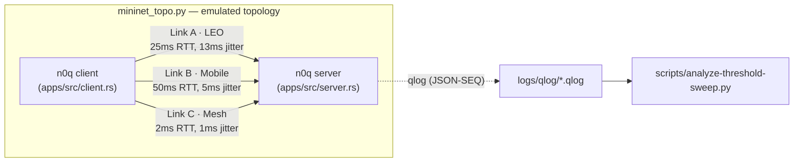
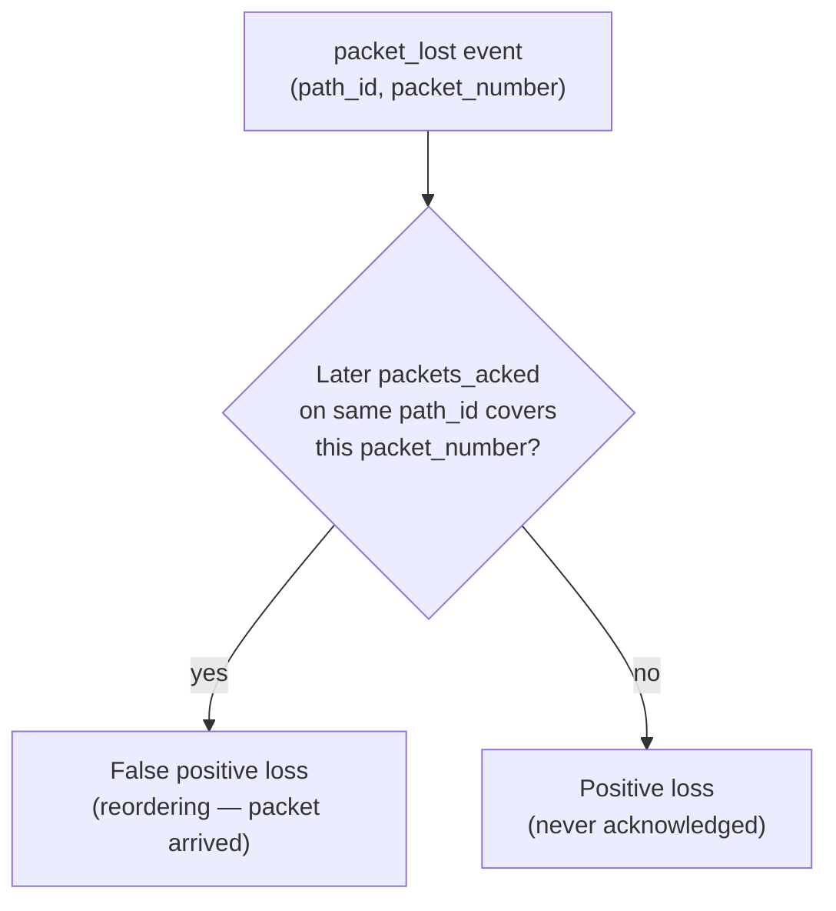
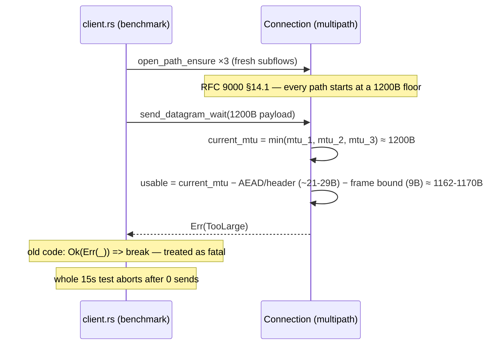

# n0q Multipath QUIC — Datagram Reliability Investigation

**Component under test:** `noq-proto` (n0q), a multipath QUIC implementation
**Harness:** `mpquic-noq` — 3-link emulated mininet topology + qlog-based analysis
**Period:** 2026-08-30 – 2026-09-01
**Status:** 8 of 9 findings closed; 1 open (NewReno collapse, root cause pending)

## 1. Executive summary

n0q was evaluated for datagram-mode (RFC 9221) multipath transport under
emulated LEO/mobile/mesh link conditions. Three qlog instrumentation bugs
were found and fixed, which then enabled a quantitative finding: **at the
RFC 9002 default `packet_threshold=3`, ~99% of all packet loss this testbed
reports is a false positive** (link jitter reordering packets past the threshold,
not real drops), wasting up to ~54% of transmitted bytes on redundant
retransmission. Raising `packet_threshold` recovers most of this, with a
congestion-controller-dependent optimum. A separate, unrelated benchmark bug
caused 100% failure (0 bytes transferred) in every early datagram-mode run;
root-caused to a multipath MTU floor interaction and fixed. One CC
(NewReno) was found to intermittently collapse to near-zero datagram
throughput, independent of threshold — flagged for follow-up, not yet
root-caused.

## 2. System under test



Each connection opens 3 multipath subflows, one per emulated link, and runs
either a bulk stream transfer or a fixed-rate datagram load for 15s.
Congestion control (BBR / CUBIC / NewReno), the (nominal) path scheduler,
and `packet_threshold` are swept as independent variables; per-path loss and
throughput are reconstructed from server-side qlogs.

## 3. Findings

| # | Problem | Status |
|---|---|---|
| 1 | Multipath scheduler flags are parsed but never wired to path selection | Diagnosed, fix deferred |
| 2 | qlog `packet_lost.trigger` always reports `reordering_threshold` | Fixed (twice — see 3.2) |
| 3 | qlog `packet_lost` omits `path_id` | Fixed |
| 4 | qlog never emits `packets_acked` | Fixed |
| 5 | ~99% of declared loss is false positive reordering, not real drops | Diagnosed |
| 6 | `packet_threshold` mistuned for this testbed's jitter profile | Characterized via sweep |
| 7 | Datagram benchmark reports 0 sent/received on every run | Fixed |
| 8 | n0q checked for picoquic's CID-retirement cache bug | Not present — verified clean |
| 9 | NewReno collapses to near-zero datagram throughput in ~15% of runs | Open — not yet root-caused |

### 3.1 Multipath scheduler is a no-op

**Problem:** `--scheduler MINRTT\|REDUNDANT\|ROUNDROBIN` (`apps/src/client.rs`)
is parsed and logged but never reaches `TransportConfig` or path-selection
code. `Connection::poll_transmit` (`noq-proto/src/connection/mod.rs:1075`)
always prefers the lowest `PathId`, falling through only on capacity
exhaustion — not RTT-aware, no duplication, no rotation.

**Verification:** (a) exhaustive grep across all 7 workspace crates for any
`Scheduler`/`MinRtt`/`Redundant`/`RoundRobin` type — none exist; (b)
statistically, holding CC and `packet_threshold` fixed, goodput spread
across the three scheduler *labels* was ~10% (72-run stream dataset) vs.
~145% across CC choice (a known real effect) — i.e. every
scheduler-attributed difference reported earlier in this investigation was
run-to-run noise.

**Resolution:** left unimplemented — a deliberate scope decision pending a
choice between a full RTT-aware/redundant implementation and a narrower
datagram-specific fix. Sweep configuration was collapsed to `MINRTT` only
once this was established, cutting run count 3x for no loss of information.

### 3.2 qlog `packet_lost.trigger` was structurally incapable of reporting `time_threshold`

**Problem:** `emit_packet_lost` (`noq-proto/src/connection/qlog.rs`) computed:

```rust
info.time_sent.saturating_duration_since(now) >= loss_delay   // always Duration::ZERO
```

`time_sent` can never be later than `now`, so this is always `false` —
every loss was reported as `reordering_threshold`, 100% of the time, across
all 72 stream-sweep runs, regardless of true cause.

**Root cause:** operands reversed. The correct, and already-present,
comparison lives a few hundred lines away in the real loss detector
(`mod.rs:3377`): `now.saturating_duration_since(info.time_sent) >= loss_delay`.

**Fix:** mirrored the correct form in `qlog.rs`. **Caught twice** — the
first fix was recorded in `TODO.md` as "[FIXED] confirmed," but a later
session, pulling exact code to cite, found the buggy version still on disk
(whether reverted or never actually committed is unresolved). Re-applied
and re-verified against source directly rather than trusting the doc.

**Scope:** never affected wire behavior — `detect_lost_packets`, which
actually drives retransmission and congestion response, always used the
correct comparison. Also never affected any throughput/loss conclusion in
this investigation, since positive-vs-false-positive classification (§3.5)
cross-references packet numbers against `packets_acked` events directly,
never the `trigger` field. **Not yet re-confirmed against a live sweep**
after the second fix.

**Full writeup:** `docs/loss-trigger-postmortem.md` (IETF compliance framing).

### 3.3 qlog `packet_lost` carried no `path_id`

**Problem:** every other per-path event (`packet_sent`, `packet_received`)
tags its path; `packet_lost` didn't, making per-path loss attribution
impossible from qlog alone in a multipath connection.

**Fix:** threaded `path_id: PathId` through `emit_packet_lost`, set on the
`PacketHeader` and the event's `tuple_id`, matching existing sibling events.

### 3.4 qlog never emitted `packets_acked`

**Problem:** the schema defines `packets_acked`; nothing in n0q called it.
Without it there was no way to tell, from qlog alone, whether a
declared-lost packet actually arrived late (false positive) or never arrived
(positive) — the exact question this investigation needed answered.

**Fix:** added `emit_packets_acked`, called from two disjoint sites in
`inner_on_ack_received` (normal newly-acked packets) and
`detect_spurious_loss` (packets already declared lost, now proven to have
arrived).

**False start:** the first attempt hooked only into `newly_acked`, built
from `sent_packets` — which `handle_lost_packets` empties via `take()` the
instant a packet is declared lost. Every run then measured a flat, bogus
0.0% false-positive rate, by construction, independent of the network. Moved the
emission into `detect_spurious_loss`'s own independent `lost_packets` map,
matching how the connection's real internal reclassification already
works.

**Lesson generalized from 3.2–3.4:** a metric reading exactly 0.000%
uniformly across every configuration is almost always instrumentation, not
a result.



**Full writeup:** `docs/qlog-loss-instrumentation-fixes.md`.

### 3.5 ~99% of declared loss is a false positive reordering (stream mode)

With §3.3–3.4 in place, every `packet_lost` was cross-referenced against
later `packets_acked` on the same path, aggregated per link:

| Link | sent | declared lost | declared % | **false positive %** | positive | positive % | netem loss |
|---|---:|---:|---:|---:|---:|---:|---:|
| A · LEO (25ms, 13ms jit) | 56,909 | 23,781 | 41.8% | **99.3%** | 178 | 0.31% | 0.17% |
| B · Mobile (50ms, 5ms jit) | 228,935 | 125,260 | 54.7% | **98.9%** | 1,362 | 0.59% | 0.006% |
| C · Mesh (2ms, 1ms jit) | 274,113 | 73,780 | 26.9% | **97.5%** | 1,862 | 0.68% | 0.0% |

RFC 9002's static `packet_threshold = 3` is badly mismatched to this
testbed's relative jitter. Positive loss (0.31–0.68%) exceeds configured
netem loss on every link — link C has 0% configured loss but the highest
positive rate, consistent with real tbf-queue congestion loss from CCs
overdriving the shaped rate.

**Consequence — wasted bandwidth:**

| Run | link Mbps | goodput Mbps | efficiency | wasted | declared loss |
|---|---:|---:|---:|---:|---:|
| MINRTT/BBR | 62.6 | 28.6 | 45.7% | 54.3% | 51.1% |
| MINRTT/CUBIC | 62.5 | 36.7 | 58.7% | 41.3% | 38.0% |
| MINRTT/NEWRENO | 5.6 | 5.1 | 90.6% | 9.4% | 4.5% |
| ROUNDROBIN/CUBIC | 62.9 | 36.5 | 58.1% | 41.9% | 38.1% |

Wasted-byte share tracks declared-loss almost exactly — since ~99% of that
loss is a false positive, roughly 40% of transmitted bytes were redundant
retransmissions of packets that had already arrived.

### 3.6 `packet_threshold` sweep — CC-dependent optimum, and mode-dependent

Added `--packet-threshold` (wired to `TransportConfig::packet_threshold`)
and swept it in both transport modes.

**Stream mode** (72 runs: 3 schedulers × 3 CCs × 8 thresholds, n=1):

| combo | pt=3 | 5 | 10 | 15 | 20 | 25 | 30 | 40 | best |
|---|---:|---:|---:|---:|---:|---:|---:|---:|---|
| MINRTT/BBR | 23.9 | 28.1 | 36.6 | 40.2 | 46.1 | **46.7** | 43.9 | 37.4 | pt=25 |
| REDUNDANT/BBR | 29.8 | 29.2 | 35.7 | 41.3 | 44.9 | 35.3 | **47.5** | 40.8 | pt=30 |
| ROUNDROBIN/BBR | 29.1 | 35.4 | 39.1 | 40.2 | 44.1 | **49.7** | 49.4 | 34.4 | pt=25 |
| MINRTT/CUBIC | 36.7 | 42.1 | 46.9 | 50.5 | 52.1 | 54.0 | **56.9** | 55.6 | pt=30 |
| REDUNDANT/CUBIC | 36.6 | 40.7 | 47.3 | 50.8 | 52.4 | 54.0 | 58.9 | **59.6** | pt=40 |
| ROUNDROBIN/CUBIC | 36.7 | 41.1 | 47.5 | 50.6 | 52.5 | 56.7 | 56.8 | **59.4** | pt=40 |
| NewReno (any) | ~4.2–5.0 across the board — flat, window-bound, not loss-bound | | | | | | | | — |

BBR peaks at pt=25–30 then *regresses* — reproduced identically across all
three scheduler labels (a real effect, not noise, given §3.1's finding that
scheduler labels carry no independent signal). Not yet root-caused;
hypothesized as BBR's probe-bw pacing-gain cycling interacting with a wider
allowed-reordering window. CUBIC shows no ceiling through pt=40.

**Datagram mode** (120 runs: MINRTT × 3 CCs × 8 thresholds, n=5, mean\[min–max\]):

| CC | pt=3 | pt=5 | pt=10 | pt=15 | pt=20 | pt=25 | pt=30 | pt=40 | best |
|---|---:|---:|---:|---:|---:|---:|---:|---:|---|
| BBR | 28.6 | 34.4 | 32.3 | 35.0 | 33.2 | 34.1 | 33.0 | **35.2** | flat from pt=5 |
| CUBIC | 35.1 | 39.1 | 36.1 | **43.2** | 42.6 | 41.1 | 38.9 | 33.5 | pt=15–20 |
| NewReno* | 3.5 | 3.8 | 3.6 | 4.2 | 4.8 | 5.3 | 4.5 | 4.1 | see §3.8 |

Datagram mode **disagrees with stream mode on which CC has a ceiling**: BBR
has none here (flat pt=5–40, no retransmission to interact with pacing
gain), CUBIC now peaks early (pt=15–20) and *declines* through pt=40 — the
reverse of its stream-mode behavior. **Thresholds tuned on one transport
mode do not transfer to the other.**

**Sanity check (passed):** positive loss stays flat across all thresholds
for BBR (0.08–1.20%) and CUBIC (0.61–1.03%) in both modes — the expected
"network property, not detector artifact" signature.

**Full writeup:** `docs/datagram-threshold-sweep-report.md`.

### 3.7 Checked for picoquic's CID-retirement cache bug — not present

picoquic was separately found to validate incoming CIDs/`RETIRE_CONNECTION_ID`
against a single cached "current CID" pointer that stops updating after a
peer CID rotation, tearing down healthy multipath connections. Traced the
equivalent n0q paths:

| Mechanism | n0q location | Pattern |
|---|---|---|
| Packet routing | `endpoint.rs:1142-1150` | hashmap lookup on arriving DCID |
| `RETIRE_CONNECTION_ID` | `cid_state.rs:162-189` | keyed removal from `FxHashSet<u64>` |
| `NEW_CONNECTION_ID` | `cid_queue.rs:60-109` | ring buffer, old CIDs valid until named |
| Multipath keying | `mod.rs:242,249` | CID maps keyed by `PathId` |

Every decision resolves by keyed lookup against a live map, never a cached
pointer. **n0q does not have this bug.**

### 3.8 Datagram benchmark: two compounding bugs, 0 bytes transferred on every run

**Bug A:** the benchmark used `send_datagram()`, which silently evicts
unsent data from the local send buffer under backpressure
(`datagrams.rs::make_space_for`, `trace!`-only). Fixed by switching to
`send_datagram_wait()`.

**Bug B (surfaced by fixing A):** the next 24-run validation sweep then
reported **0 sent / 0 received on every single run.**



**First hypothesis, disproven:** suspected `SendDatagram::poll`'s retry
loop (`noq/src/connection.rs:1164-1198`) discarding unblock notifications.
Built a standalone single-path repro (2000 datagrams through a saturated
1MB buffer) — completed in 30ms. Rust's `Future::poll` always restarts at
the top of the function on each fresh executor call, so the real send does
get retried; this code was untouched.

**Actual root cause:** extending the repro to 3 multipath subflows
reproduced the failure immediately as `TooLarge`. `Connection::current_mtu()`
(`mod.rs:7022`) is, by design, the minimum MTU across all active paths
(correct per RFC 9221 §4 — a datagram safe for the smallest path is safe
everywhere). The benchmark opens 3 fresh subflows moments before the test,
so at least one is still at the 1200-byte floor, pinning usable size below
the hard-coded 1200-byte payload on every attempt.

**Fix:** query `conn.max_datagram_size()` every send, size the payload to
`min(1200, max_size)`, and retry (not abort) on `TooLarge` — spec-correct,
since RFC 9221 always intended the limit to be dynamic.

**Verification:** local loopback 0/0 → 14,992/14,992 sent/received, 46.42
Mbps. Live mininet sweep recovered real throughput across all CCs:

| CC | goodput range (n=2) | mean |
|---|---|---:|
| CUBIC | 31.8–45.7 Mbps | ~39 Mbps |
| BBR | 23.5–39.0 Mbps | ~31 Mbps |
| NewReno | 1.4–5.5 Mbps | ~3.4 Mbps |

**Methodology caveat found in the same investigation:** "Sent N dgrams"
only means "accepted into the local outgoing queue," not "on the wire" —
`conn.close()` discards whatever's still queued. Gap scales inversely with
throughput (CUBIC 2–11%, BBR 10–40%, NewReno 18–73%). The reported `Mbps`
(computed from received bytes) is unaffected; the sent counter is not a
valid transmission-rate metric.

**Gotcha that cost one full wasted sweep cycle:** `mininet_topo.py` runs
prebuilt `target/release/n0q-{server,client}` binaries directly whenever
they exist, and does not rebuild them automatically — a source fix has no
effect until `cargo build --release --bin n0q-server --bin n0q-client` is
run explicitly.

**Full writeup:** `docs/datagram-mtu-fix.md`.

### 3.9 NewReno intermittently collapses to near-zero throughput — open

Surfaced only at n=5 (invisible at n=2). **6 of 40 NewReno datagram runs
(15%)** crash to 0.14–1.67 Mbps — 3–30x below every other NewReno run —
with a distinctly different loss signature, not just a lower number:

| run | Mbps | sent | positive loss % | false positive % |
|---|---:|---:|---:|---:|
| pt=3 rep=4 | 0.23 | 3,942 | 6.14% | 35.6% |
| pt=5 rep=2 | 0.16 | 4,220 | 6.09% | 45.6% |
| pt=10 rep=3 | 0.31 | 4,779 | 5.71% | 41.3% |
| pt=15 rep=5 | 0.15 | 4,311 | 6.05% | 46.8% |
| pt=30 rep=4 | 1.67 | 5,836 | 4.20% | 49.6% |
| pt=40 rep=3 | 0.14 | 4,207 | 5.82% | 48.5% |
| *other 34 runs* | 3.6–6.5 | 7,500–12,500 | 0.86–2.56% | 67.8–85.2% |

Positive (confirmed-never-acked) loss more than doubles and the false-positive
share drops sharply — consistent with a congestion window collapsing early
and staying pinned near its floor for the rest of the 15s run (too little
in flight to reorder, so what loss occurs is more likely real). Confirmed
against raw logs, e.g. pt=3 rep=4: `Sent 7809, Received 374` — a 95%
delivery failure, far beyond the normal queueing-gap artifact (§3.8).

Occurs roughly evenly across every threshold — **not something
`packet_threshold` fixes.** It also explains away the apparent "NewReno
peaks at pt=25" in the raw headline table (§3.6): collapse-run sampling
luck. Recomputing with the 6 collapse runs excluded:

| threshold | 3 | 5 | 10 | 15 | 20 | 25 | 30 | 40 |
|---|---:|---:|---:|---:|---:|---:|---:|---:|
| mean, collapses excluded | 4.26 | 4.67 | ~4.8 | 5.15 | 4.77 | 5.30 | 5.18 | 5.10 |

Once excluded, NewReno is flat at ~4.3–5.3 Mbps regardless of threshold —
consistent with the stream-mode conclusion that it is window-bound, not
loss-bound. **Not yet root-caused**; likely the same "AIMD can't rebuild
after a multiplicative-decrease cut at these RTTs" mechanism documented for
stream mode, in its worst-case form. Next step: pull
`congestion_window`/`bytes_in_flight` from a collapsed run's qlog (e.g.
pt=40 rep=3) against a normal run at the same threshold to see when/how
hard the window is cut and whether recovery is ever attempted before the
15s cutoff.

## 4. Process lessons

- **Never cite a "[FIXED]" doc claim without grepping current source.** A
  TODO.md entry marked "fixed and confirmed" was found to not match the
  code on disk in a later session (§3.2).
- **A metric reading exactly 0.000% uniformly across every configuration is
  almost always instrumentation, not a result** (§3.4).
- **Rebuild release binaries after every source change** —
  `mininet_topo.py` silently prefers stale prebuilt binaries over
  `cargo run` (§3.8).
- **`logs/` is ephemeral and gitignored** — it disappeared once mid-session
  for unexplained reasons; anything worth keeping must be extracted into a
  committed file promptly.
- **Build a minimal reproduction before trusting a single read of async
  retry-loop code** — the initial `SendDatagram::poll` hypothesis (§3.8)
  looked plausible on inspection and was wrong.
- **Every sweep cell run so far is n=1 (stream) or n=5 (datagram, after
  scaling up)** — two of three CC conclusions from the n=2 datagram pass
  did not survive the n=5 sample (§3.6, §3.9). Treat low-repeat sweep cells
  in this project's history with corresponding skepticism.

## 5. Open items

| Item | State |
|---|---|
| Real scheduler implementation (§3.1) | Deferred — scope decision pending |
| BBR stream-mode ceiling at pt≈25–30 | Observed, not root-caused |
| NewReno datagram-mode collapse (§3.9) | Observed, not root-caused |
| Re-fixed trigger label (§3.2) | Needs one live-sweep confirmation |

## 6. References

- `TODO.md` — full chronological working log
- `docs/SESSION-HANDOFF.md` — cold-start session handoff
- `docs/loss-trigger-postmortem.md` — §3.2, IETF compliance framing
- `docs/qlog-loss-instrumentation-fixes.md` — §3.2–3.4, developer reference
- `docs/datagram-mtu-fix.md` — §3.8
- `docs/datagram-threshold-sweep-report.md` — §3.6 datagram mode, §3.9
- `scripts/analyze-threshold-sweep.py`, `scripts/threshold_sweep_master.csv`,
  `scripts/threshold_sweep_analysis_{stream,datagram}.csv` — raw data
